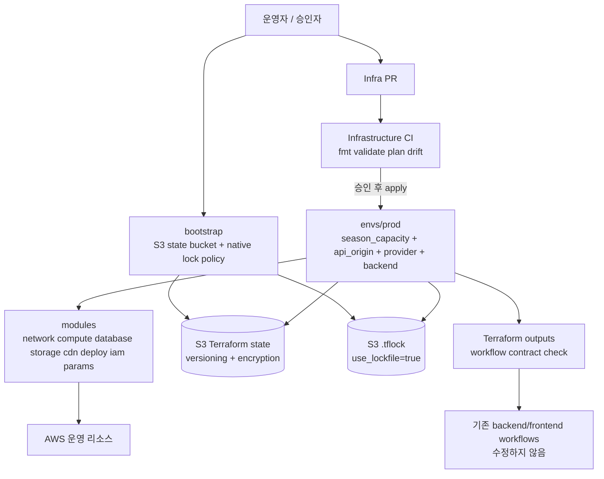
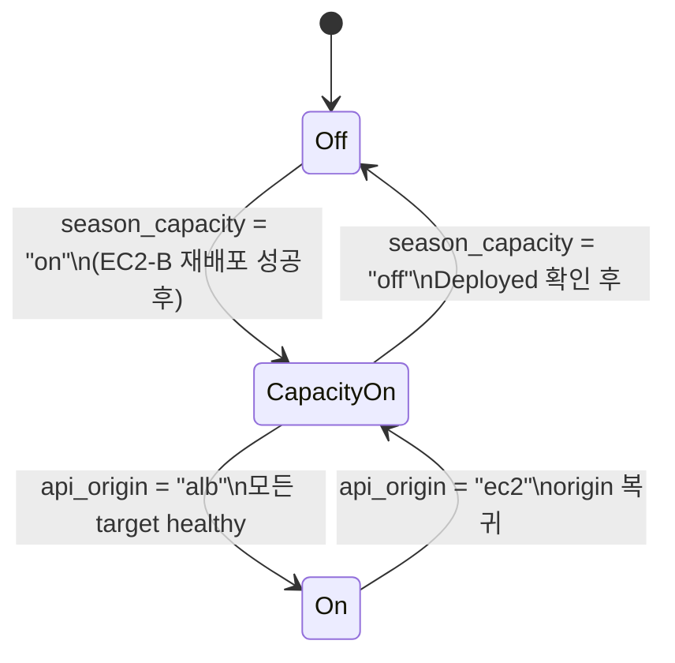
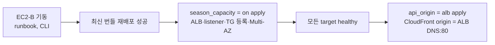

# BOAZ 운영 AWS 인프라 Terraform 마이그레이션 설계

## Overview

### 목적과 범위

이 설계는 운영 중인 BOAZ 공식 홈페이지(`www.bigdataboaz.com`)와 API 서버 AWS 인프라를 신규 `BOAZ-website/product-infra` 저장소로 코드화하는 lift-and-codify 설계다. 애플리케이션 코드, `backend/.github/workflows/cd.yml`, `frontend/.github/workflows/deploy-www.yml`, `frontend/.github/workflows/deploy-dev.yml`, CodeDeploy hook, Spring 설정은 수정하지 않는다.

현재 운영 스크립트의 동작을 보존한다.

- 평시(`season_capacity = "off"`, `api_origin = "ec2"`): CloudFront → EC2-A:8080, EC2-B 중지, ALB/listener 없음, Target Group은 EC2-A, RDS Multi-AZ false.
- 모집 시즌(`season_capacity = "on"`, `api_origin = "alb"`): CloudFront → ALB:80 → EC2-A/B:8080, EC2-B 실행 및 `app=boaz-api`, RDS Multi-AZ true.
- 시즌 시작은 EC2-B 기동 → 최신 번들 재배포 성공 → `season_capacity = "on"` apply → target healthy 확인 → `api_origin = "alb"` apply 순서로 실행한다.
- 시즌 종료는 반드시 `api_origin = "ec2"` apply(origin 복귀) → CloudFront `Deployed` 확인 → `season_capacity = "off"` apply(ALB 제거)의 두 단계로 실행한다.

운영 리소스는 삭제 후 재생성하지 않는다. AWS CLI 사전 조사에서 실제 식별자와 현재 설정을 확인한 리소스만 Terraform `import` 블록으로 취득한다. 조사할 수 없는 대상은 추정해서 생성·import하지 않고 `docs/import-log.md`에 `미확인` 또는 `관리 제외`로 기록한다.

### 설계 원칙

1. `requirements.md`를 source of truth로 사용하고, 이 문서의 예시 placeholder를 실제 AWS 식별자로 오인하지 않는다.
2. 모든 AWS 사전 조사는 `--profile tf --region ap-northeast-2`를 사용한다. CloudFront 전역 API는 profile만 사용하고, CloudFront ACM은 `us-east-1` provider alias로 조회한다.
3. Terraform은 `>= 1.11.0, < 2.0.0`으로 고정한다(S3 backend 자체 잠금 `use_lockfile`은 1.10에서 도입, 1.11에서 정식 지원). AWS provider 버전 범위는 `docs/records/decisions.md`의 "AWS provider 버전" 결정에 따른다(현재 기준 `>= 5.0.0, < 6.0.0`). `.terraform.lock.hcl`을 커밋한다.
4. 운영 리소스의 `destroy`·`replace`, Secret_Parameter 값 노출, 미확정 식별자 사용, backend/lock 실패는 apply 전에 차단한다.
5. 기존 배포 workflow가 기대하는 이름·버킷·배포 ID·role ARN을 output과 계약 검사로 보존한다.

### 조사 결과와 한계

이 설계 작성 시점에 `aws sts get-caller-identity --profile tf --region ap-northeast-2`를 포함한 AWS CLI 조회를 실행했으나 현재 실행 환경에 `tf` profile이 없어 인증 전 단계에서 실패했다. 따라서 아래 값들은 저장소의 현행 스크립트와 workflow에서 발견한 **미검증 참조값**일 뿐, import ID·최종 Terraform 값으로 확정하지 않는다.

| 현행 참조값 | 출처 | 상태 |
|---|---|---|
| EC2-B 인스턴스 ID | `backend/infra/scripts/register-ssm-params.sh` | AWS CLI 미검증 |
| API CloudFront 배포 ID | 동일 스크립트 | AWS CLI 미검증 |
| RDS `boaz-prod-db` | 동일 스크립트 | AWS CLI 미검증 |
| CodeDeploy `boaz-backend` / `codedeploy-prod` | `backend/.github/workflows/cd.yml`, 스크립트 | AWS CLI 미검증 |
| S3 `boaz-codedeploy-bucket` | `backend/.github/workflows/cd.yml`, 스크립트 | AWS CLI 미검증 |
| Target Group ARN, ALB SG, ALB subnet IDs | `register-ssm-params.sh` | AWS CLI 미검증 |
| backend OIDC role `role-prod-github-actions` ARN | `backend/.github/workflows/cd.yml` | AWS CLI 미검증 |
| frontend 운영/개발 bucket·CloudFront ID·`AWS_ROLE_ARN` | GitHub Secrets 이름만 workflow에서 확인 | 값 미확인 |

공식 문서 조사 결과 S3 backend는 `use_lockfile = true`로 S3 native lock을 사용할 수 있고 lockfile에 별도 `GetObject`·`PutObject`·`DeleteObject` 권한이 필요하다. Terraform import block은 plan 단계에서 import와 구성 정합화를 검토하는 방식이며, input validation·precondition은 plan/apply를 차단하는 검증에 사용한다. 설계 근거는 [Terraform S3 backend](https://developer.hashicorp.com/terraform/language/backend/s3), [Terraform import](https://developer.hashicorp.com/terraform/language/import), [Terraform custom conditions](https://developer.hashicorp.com/terraform/language/expressions/custom-conditions), [AWS ACM regional certificates](https://docs.aws.amazon.com/acm/latest/userguide/acm-regions.html)를 따른다.

## Architecture

### 논리 구조

`BOAZ-website/product-infra`는 운영 리소스를 소유하는 유일한 Terraform 저장소다. `bootstrap`은 state 저장 기반을 먼저 만들고, `envs/prod`는 운영 리소스만 관리한다. 재사용 가능한 책임은 `modules/*`로 분리한다.



### 적용 경계

- `bootstrap`: state bucket, versioning, SSE, public access block, bucket policy 및 native lockfile 권한을 준비한다. DynamoDB lock table은 만들지 않는다.
- `envs/prod`: `ap-northeast-2` 운영 환경의 네트워크, 컴퓨팅, DB, S3, CDN, 배포, IAM, SSM infra parameter를 관리한다.
- `modules/*`: resource와 data source의 구현을 캡슐화하며 계정 ID·region·resource ID literal을 두지 않는다.
- `docs/*`: import 근거, 시즌 전환 절차, 검증 증적을 한국어로 보존한다.
- 애플리케이션 저장소: workflow 계약의 소비자이며 변경 대상이 아니다.

### Terraform 버전·provider

`envs/prod/versions.tf`에는 다음 제약을 둔다.

```hcl
terraform {
  required_version = ">= 1.11.0, < 2.0.0"

  required_providers {
    aws = {
      source  = "hashicorp/aws"
      version = ">= 5.0.0, < 6.0.0"
    }
  }
}
```

provider는 기본 `aws`를 `ap-northeast-2`에 두고, CloudFront ACM용 `aws.us_east_1` alias를 둔다. 두 provider 모두 `default_tags`에 `Project=boaz`, `Environment=prod`, `ManagedBy=terraform`, `Repository=BOAZ-website/product-infra`를 적용한다. 적용 불가 리소스는 `docs/import-log.md`에 리소스 종류와 사유를 목록화하며, 공통 태그 목록 자체는 apply 차단 조건으로 사용하지 않는다.

## Components and Interfaces

### 저장소 구조

```text
BOAZ-website/product-infra/
├── bootstrap/
│   ├── versions.tf
│   ├── providers.tf
│   ├── variables.tf
│   ├── main.tf
│   ├── outputs.tf
│   └── README.md
├── envs/
│   └── prod/
│       ├── backend.tf
│       ├── versions.tf
│       ├── providers.tf
│       ├── variables.tf
│       ├── locals.tf
│       ├── main.tf
│       ├── outputs.tf
│       ├── imports.tf
│       ├── checks.tf
│       ├── terraform.tfvars.example
│       └── backend.hcl.example
├── modules/
│   ├── network/
│   ├── compute/
│   ├── database/
│   ├── storage/
│   ├── cdn/
│   ├── deploy/
│   ├── iam/
│   └── params/
├── .github/workflows/
│   ├── terraform-pr.yml
│   ├── terraform-apply.yml
│   └── terraform-drift.yml
├── docs/
│   ├── runbook-season.md
│   ├── import-log.md
│   ├── inventory.md
│   ├── workflow-contract.md
│   └── decisions.md
├── .terraform.lock.hcl
├── README.md
└── .gitignore
```

`envs/<env>/`를 같은 규칙으로 추가할 수 있도록 environment별 변수·backend key·provider만 root에서 조정한다. module에는 환경 이름이나 운영 account ID를 default로 넣지 않는다.

### `bootstrap`과 `envs/prod` backend/state

#### Bootstrap 순서

1. `tf` profile과 AWS account/region을 확인한다. 확인 실패 시 진행하지 않는다.
2. AWS CLI로 state bucket 후보가 실제 존재하는지, 버저닝·암호화·public access block을 조사한다. 요구사항의 기본 원칙은 전용 신규 state bucket을 bootstrap으로 생성하는 것이다. 기존 후보 bucket이 발견되어도 자동으로 재사용하거나 import하지 않으며, account owner의 명시적 예외 승인이 없는 한 신규 전용 bucket을 사용한다. 예외적으로 기존 bucket을 재사용/import할 때에는 재사용 사유, account owner 승인, versioning·SSE·public access block·최소 권한 policy 확인 결과를 `docs/import-log.md`에 기록한다. 이름을 추정하지 않는다.
3. `bootstrap`은 초기에는 local state로 실행할 수 있으며, state bucket을 만든 뒤 bootstrap state 자체를 별도 확정 key로 S3로 migrate한다. 이 단계는 `envs/prod` backend 초기화보다 먼저 완료한다.
4. `bootstrap` resource에는 `prevent_destroy = true`를 적용한다. state bucket, versioning, encryption, public access block, bucket policy를 환경 구성과 분리한다.
5. `envs/prod`에 확정한 bucket/key/region을 partial backend config로 주입한 뒤에만 `terraform init`을 실행한다.

`bootstrap`에는 state bucket 이외의 운영 resource를 두지 않는다. native lock은 별도 DynamoDB resource가 아니라 state key 옆의 `<key>.tflock` S3 object다. 따라서 bootstrap은 lock object에 필요한 IAM/bucket policy 권한을 준비하고, `aws_dynamodb_table`과 `dynamodb_table` backend argument는 사용하지 않는다.

#### `envs/prod/backend.tf`

최종 조사 전에는 placeholder를 commit하지 않는다. 조사 완료 후 확정값을 `backend.hcl` 및 README와 동일하게 기록한다.

```hcl
terraform {
  backend "s3" {
    # bucket, key, region은 확인된 backend.hcl로 주입한다.
    use_lockfile = true
  }
}
```

예상 backend 설정은 다음 계약을 갖는다.

```text
bucket       = <AWS CLI로 확인한 전용 state bucket>
key          = envs/prod/terraform.tfstate
region       = ap-northeast-2
use_lockfile = true
```

`envs/prod/terraform.tfstate`와 다른 환경 key는 절대 겹치지 않으며, 실제 bucket/key는 `README.md`, `backend.hcl`, `docs/import-log.md`에 같은 값으로 기록한다. backend credential은 코드에 넣지 않고 `tf` profile 또는 GitHub OIDC role을 사용한다. S3 state bucket에는 versioning, SSE, public access block, 최소 권한 bucket policy를 강제한다.

#### Lock 및 실패 정책

- lock 획득 실패는 즉시 비정상 종료하며 재시도하여 강제 unlock하지 않는다.
- `terraform force-unlock`은 lock 소유 실행이 실제로 종료되었음을 확인하고 승인자가 실행한 경우에만 runbook에 기록한다.
- backend init 실패나 lock 실패 시 state와 운영 resource를 변경하지 않는다.
- plan·state·log에 Secret_Parameter의 실제 값이 보이면 pipeline을 실패시키고 해당 증적을 보존하되 비밀값을 추가 출력하지 않는다.

### Module interface와 주요 resource

#### `modules/network`

책임: 기존 VPC, subnet, route table, internet gateway, NACL 연결과 SG 규칙을 조사 근거에 맞게 import/관리한다. 모든 SG 규칙은 개별 `aws_vpc_security_group_ingress_rule`와 `aws_vpc_security_group_egress_rule`로 정의한다.

주요 resource/data:

- `aws_vpc`, `aws_subnet`, `aws_route_table`, `aws_internet_gateway` (실제 관리 여부에 따라 import 또는 data source)
- `aws_ec2_managed_prefix_list` data 또는 확인된 CloudFront managed prefix list 참조
- `aws_security_group` 및 개별 ingress/egress rule

입력: `vpc_id`, `subnet_ids`, route/IGW 관리 여부, `cloudfront_prefix_list_id`, `alb_security_group_id`, `ec2_security_group_id`, 포트와 승인된 CIDR/SG 관계.

출력: `vpc_id`, public/private subnet IDs, route table IDs, `alb_security_group_id`, `ec2_security_group_id`, `cloudfront_prefix_list_id`, `network_inventory`.

CloudFront → ALB SG inbound는 조사로 확정한 prefix list ID만 허용한다. EC2 SG inbound TCP 8080은 ALB SG를 source로 한다. `0.0.0.0/0` 또는 `::/0` SSH 등 과도한 규칙은 import-log에 현행 규칙·위험·축소안을 기록한다. 승인 전에는 해당 과도한 보안 그룹 규칙의 변경만 apply를 차단하며, 무관한 리소스의 plan/apply는 허용한다.

#### `modules/compute`

책임: EC2-A/EC2-B의 identity, profile, state, functional tag, drift 보호를 관리한다.

주요 resource:

- `aws_instance.ec2_a`, `aws_instance.ec2_b` (확정 ID import)
- `aws_ec2_instance_state.ec2_b` (EC2-B running/stopped 상태)
- `aws_eip`는 권고안으로만 기록하며 승인 전 생성하지 않음
- instance profile은 `modules/iam` output을 입력으로 받음

입력: 확정된 instance IDs, subnet/SG, `season_capacity`, `drift_risk_confirmed`, EC2-B desired state, 기능 태그 map, IAM instance profile.

출력: `ec2_a_id`, `ec2_b_id`, `ec2_a_origin`, `ec2_a_dns`, `ec2_b_state`, `ec2_a_private_ip`, `instance_profile_name`.

`drift_risk_confirmed=true`일 때 실제 drift가 확인된 AMI·`user_data`·AWS-managed tag만 `lifecycle.ignore_changes`에 넣는다. `app=boaz-api` 같은 기능 태그는 ignore하지 않는다. 이름·배포 대상 태그가 변경되거나 replacement가 계획되면 apply를 차단한다.

#### `modules/database`

책임: RDS instance와 연결 그룹을 import하고 Multi-AZ와 데이터 보호 설정을 관리한다.

주요 resource:

- `aws_db_instance`
- `aws_db_subnet_group`
- `aws_db_parameter_group`
- RDS SG는 network module의 SG rule과 연결

입력: 확인된 DB identifier, instance class/storage/engine version, subnet group, parameter group, SG, `season_capacity`, password 관리 정책.

출력: `db_instance_id`, `db_endpoint`, `db_port`, `multi_az`, `db_subnet_group_name`, `db_security_group_id`.

항상 `deletion_protection=true`, `skip_final_snapshot=false`를 강제한다. password는 configuration, tfvars, plan, log에 두지 않고 `lifecycle.ignore_changes = [password]` 또는 승인된 write-only/managed-secret 방식만 허용한다. `password` diff, RDS destroy 또는 replacement가 있으면 apply하지 않는다. Multi-AZ on/off는 기존 instance의 in-place 변경인지 plan JSON에서 확인한다.

#### `modules/storage`

책임: 배포 번들, frontend, 지원서 upload, archiving S3 bucket과 bucket-level 설정을 관리한다.

주요 resource:

- `aws_s3_bucket`
- `aws_s3_bucket_versioning`
- `aws_s3_bucket_server_side_encryption_configuration`
- `aws_s3_bucket_public_access_block`
- `aws_s3_bucket_lifecycle_configuration`
- `aws_s3_bucket_policy`

입력: 조사로 확정한 bucket names/regions, policy, versioning, encryption, public access block, lifecycle 보존 승인.

출력: `deployment_bucket_name/arn`, `www_bucket_name/arn`, `dev_bucket_name/arn`, `upload_bucket_name/arn`, `archive_bucket_name/arn`, `bucket_contracts`.

기존 이름은 변경하지 않는다. `deploy-bundle-<sha>.zip` lifecycle은 보존 기간과 삭제 승인자가 `decisions.md`에 확정된 뒤에만 적용한다. 모든 bucket은 protected resource로 `prevent_destroy=true`를 적용한다.

#### `modules/cdn`

책임: API/www/admin CloudFront distribution, Route53 record, ACM certificate를 관리하고 API origin 전환 안전성을 보장한다.

주요 resource/data:

- `aws_cloudfront_distribution.api`, `.www`, `.admin`
- `aws_route53_zone`, `aws_route53_record`
- `aws_acm_certificate` 또는 확정 ARN data source with provider `aws.us_east_1`
- API origin 검증용 variable validation/precondition/check

입력: 확정된 distribution IDs, aliases, origin, cache/behavior/error response policy, `api_origin`, ALB DNS, EC2-A DNS, ACM ARN/region, Route53 zone/record.

출력: `api_distribution_id`, `api_origin_domain`, `api_origin_port`, `www_distribution_id`, `admin_distribution_id`, `route53_zone_id`, `acm_certificate_arn`, `workflow_distribution_contract`.

API distribution의 `Origins.Quantity == 1`을 plan 전 검증한다. 1개가 아니거나 현재 설정을 읽을 수 없으면 plan/apply를 실패시킨다. `api_origin=alb`에서는 `aws_lb` resource attribute의 DNS와 port 80, `ec2`에서는 EC2-A resource attribute와 port 8080을 사용한다. EC2-A domain은 SSM literal을 source로 삼지 않는다. www SPA의 403/404 → `/index.html`, cache policy, aliases, viewer certificate를 import 후 보존한다.

ACM 인증서가 CloudFront viewer certificate이면 `aws.us_east_1` provider로 조회/관리한다. certificate ARN과 region을 AWS CLI로 확인하지 못하면 import·plan·apply를 진행하지 않는다.

#### `modules/deploy`

책임: CodeDeploy application/deployment group과 기존 배포 계약을 관리한다.

주요 resource:

- `aws_codedeploy_app`
- `aws_codedeploy_deployment_group`
- deployment role, target tag, deployment config 설정은 조사 결과 그대로 보존

입력: 확정된 application/group names, service role, deployment config, target tag, bundle bucket.

출력: `codedeploy_app_name`, `codedeploy_deployment_group_name`, `codedeploy_service_role_arn`, `backend_deploy_contract`.

CodeDeploy deployment group의 실제 deployment configuration(예: `CodeDeployDefault.AllAtOnce`)·대상 태그·service role은 AWS CLI 조사 결과를 기준으로 보존한다. 이는 현행 `season-up.sh`가 마지막 성공 배포를 재실행할 때 명시하는 임시 `CodeDeployDefault.OneAtATime` 설정과 별개의 계약이다. 시즌 전환 중 재배포에 `CodeDeployDefault.OneAtATime`을 사용할 경우에는 일시적 운영 절차와 적용 범위를 `docs/runbook-season.md` 및 `docs/decisions.md`에 별도로 기록하며, Terraform이 deployment group의 실제 설정을 이를 근거로 변경하지 않는다. workflow 파일을 Terraform이 수정하거나 생성하지 않는다.

#### `modules/iam`

책임: GitHub OIDC, backend/frontend deploy role, EC2 instance role, Infra CI plan/apply role을 least privilege로 관리한다.

주요 resource:

- `aws_iam_openid_connect_provider`
- `aws_iam_role`, `aws_iam_role_policy`, `aws_iam_role_policy_attachment`
- 필요한 `aws_iam_policy`

입력: OIDC URL/thumbprint/client IDs, 확정 role ARN, trust subject 조건, policy resource ARN, plan/apply 구분.

출력: `github_oidc_provider_arn`, `backend_deploy_role_arn`, `frontend_deploy_role_arn`, `infra_plan_role_arn`, `infra_apply_role_arn`, `ec2_instance_profile_name`.

EC2 role에는 SSM `GetParameter`/`GetParameters` with decryption, 배포 bundle S3 read, CodeDeploy agent에 필요한 최소 권한만 둔다. Infra plan role은 read-only, apply role은 write 권한으로 분리한다. 장기 access key는 workflow·repository secret에 추가하지 않는다. OIDC provider/role/trust condition이 미확정이면 apply workflow를 활성화하지 않는다.

#### `modules/params`

책임: `/boaz/infra/*` 12개 식별자 parameter의 이름·타입·값 파생 관계를 관리하고 앱 secret을 값 관리 대상에서 제외한다.

주요 resource/data:

- 12개 `aws_ssm_parameter`는 managed resource attribute 또는 다른 module output에서 `value`를 파생한다.
- `/boaz/app/*`, `DB_*`, `JWT_SECRET`, OAuth client, `SWAGGER_*` 등 Secret_Parameter는 값 소유 resource로 만들지 않는다.
- secret 존재/type/KMS key 검증은 값 필드를 출력하지 않는 별도 read-only 검사와 CI 증적으로 수행한다.

입력: managed resource outputs, 확정된 `/boaz/infra/*` names, parameter type, KMS key ID, secret parameter name inventory.

출력: `infra_parameter_names`, `infra_parameter_arns`, `parameter_contract`, `secret_parameter_inventory_status`.

정확히 12개가 아니거나 값이 resource/module output이 아닌 literal이면 plan/apply를 차단한다. secret 값은 query, `--with-decryption`, state, plan, output, log에 넣지 않는다. 기존 루트 parameter 이름은 변경하지 않고 `/boaz/app/*` 이관은 후속 과제로 기록한다. `register-ssm-params.sh`는 migration 완료 후 deprecated/deleted 상태를 기록한다.

### 시즌 상태 모델: `season_capacity` + `api_origin`

한 번의 apply로는 "대상 healthy 확인 후 origin 교체", "origin 복귀 반영 후 ALB 제거" 순서를 보장할 수 없으므로 시즌 상태를 변수 2개로 나눈다.

| 변수 | 값 | 제어 대상 |
|---|---|---|
| `season_capacity` | `off` / `on` | ALB·listener, EC2-B 실행 상태와 기능 태그, Target Group 등록 대상, RDS Multi-AZ |
| `api_origin` | `ec2` / `alb` | API CloudFront origin (EC2-A:8080 / ALB DNS:80) |



| 상태 | `season_capacity` | `api_origin` | ALB/listener | EC2-B | Target Group | API CloudFront origin | RDS |
|---|---|---|---|---|---|---|---|
| Off(평시) | `off` | `ec2` | absent | stopped, `app=boaz-api` 없음 | EC2-A 단독 | EC2-A, `8080` | `multi_az=false` |
| CapacityOn(전환 중) | `on` | `ec2` | ALB present, listener HTTP :80 | running, `app=boaz-api` | EC2-A + EC2-B | EC2-A, `8080` | `multi_az=true` |
| On(모집 시즌) | `on` | `alb` | ALB present, listener HTTP :80 | running, `app=boaz-api` | EC2-A + EC2-B | ALB resource attribute DNS, `80` | `multi_az=true` |

- `season_capacity`는 `off`·`on`, `api_origin`은 `ec2`·`alb`만 허용한다. 오타와 임의 값은 plan 이전에 실패한다.
- `api_origin = "alb"`이면서 `season_capacity = "off"`인 조합은 precondition으로 plan 전에 실패시킨다(ALB 없이 origin을 ALB로 바꾸는 상태 금지).
- RDS Multi-AZ 전환은 수십 분 걸리므로 runbook에서 별도 단계로 분리한다.
- ALB DNS, EC2-A origin, IDs는 수동 variable로 받지 않고 resource attribute/output reference로 연결한다.

## Data Models

### Terraform 입력 모델

```hcl
variable "season_capacity" {
  type        = string
  description = "시즌 용량 상태(ALB·EC2-B·Target Group 등록·RDS Multi-AZ)"
  validation {
    condition     = contains(["off", "on"], var.season_capacity)
    error_message = "season_capacity must be exactly off or on."
  }
}

variable "api_origin" {
  type        = string
  description = "API CloudFront origin 대상(ec2: EC2-A:8080, alb: ALB:80)"
  validation {
    condition     = contains(["ec2", "alb"], var.api_origin)
    error_message = "api_origin must be exactly ec2 or alb."
  }
}

variable "drift_risk_confirmed" {
  type        = bool
  description = "AWS CLI 조사에서 EC2 drift 교체 위험을 확인했는지"
}
```

추가 입력은 조사 확정값, 승인된 policy, 환경 구성을 표현하지만 secret value나 추정된 ARN/ID를 default로 제공하지 않는다.

### State와 민감 데이터 모델

- 운영 state: S3의 확정 `envs/prod/terraform.tfstate`, versioning/SSE 보호.
- lock: 같은 key의 `.tflock` object, `use_lockfile=true`.
- sensitive variable: Terraform variable에 `sensitive=true`를 지정하고 민감 output을 만들지 않는다.
- RDS password: Terraform 값 관리 대상이 아니며 password diff를 금지한다.
- Secret_Parameter: 존재/type/KMS key만 검증하며 실제 value를 Terraform state에 저장하지 않는다.
- Infra_Parameter: resource attribute/module output에서 파생된 12개 map을 state에 저장한다. 이 값은 식별자이지 앱 secret이 아니다.

### Import_Log 레코드 모델

`docs/import-log.md`의 각 항목은 다음 필드를 갖는다.

```text
- group: network | iam-params | storage | compute | database | alb-target | cdn-route53-acm | deploy
- terraform_address:
- aws_identifier:
- identifier_source: AWS CLI command + output field
- observed_at_utc:
- current_configuration_summary:
- ownership: managed | data_source | excluded | unconfirmed
- import_block_commit:
- plan_exit_code_and_summary:
- remaining_diff:
- destroy_replace_check: pass | blocked
- approval_or_recovery_action:
- operator:
```

secret value, password, decrypted SSM output은 어떤 필드에도 기록하지 않는다.

### Workflow contract 모델

Terraform outputs는 다음 계약을 노출한다.

```text
backend_codedeploy_app_name
backend_codedeploy_group_name
backend_bundle_bucket_name
backend_deploy_role_arn
frontend_www_bucket_name
frontend_dev_bucket_name
frontend_www_distribution_id
frontend_admin_distribution_id
```

Infra CI는 output을 기존 workflow의 literal/secret reference와 비교한다. 현재 backend workflow에서 확인된 이름은 `boaz-backend`, `codedeploy-prod`, `boaz-codedeploy-bucket`, region `ap-northeast-2`이며, role ARN은 저장소 파일의 현행 참조값으로만 기록하고 AWS 조사 전에는 확정하지 않는다. frontend secret의 실제 값은 조회·기록하지 않고 secret 이름과 실행 결과로만 계약을 검증한다.

## Declarative Import 및 운영 절차

### 사전 조사와 식별자 확정

`docs/inventory.md`에 다음 AWS CLI 결과를 값 노출 최소화 query로 저장한다.

1. account identity, region, VPC/subnet/route/IGW/NACL.
2. EC2-A/B ID, state, SG, subnet, IAM profile, AMI, public/private DNS, user_data drift 위험.
3. SG 전체 inbound/outbound와 CloudFront managed prefix list ID.
4. RDS instance, subnet group, parameter group, SG, Multi-AZ, deletion protection.
5. API/www/admin CloudFront ID, origin 수와 domain/port, behaviors, cache/error response, aliases, viewer certificate.
6. S3 bucket 전체 목록, region, versioning, encryption, public access block, policy, lifecycle.
7. Route53 hosted zone와 `www`, `dev`, `api` record.
8. ACM ARN와 certificate region.
9. CodeDeploy app/group/service role/deployment config.
10. GitHub workflow 계약과 AWS 조회 결과의 대조. GitHub secret 값 자체는 출력하지 않는다.
11. `/boaz/infra/*` 이름·type·KMS key만 조회하고 앱 secret value는 조회하지 않는다.
12. Target Group 등록 target/health/health check와 `boaz-alb` 존재 여부.

각 query는 `--profile tf --region ap-northeast-2`를 쓰고, CloudFront/ACM은 서비스의 요구 region을 따른다. command가 실패하거나 결과가 여러 개이면 해당 대상은 미확정이다.

### 표준 import 순서

다음 순서를 기본으로 하며, 순서를 바꾸면 `Import_Log`에 dependency 근거를 남긴다.

1. network: VPC → subnet → route table/IGW → SG/rules
2. IAM 및 SSM: OIDC/roles/policies → `/boaz/infra/*`
3. S3 storage
4. EC2 compute
5. RDS database
6. Target Group → ALB/listener
7. CloudFront → Route53 → ACM
8. CodeDeploy/deploy contract

각 그룹에서 `imports.tf`에 Terraform 1.5+ import block을 추가하고, `terraform plan -out=plan.bin`으로 import와 resource configuration diff를 함께 검토한다. import ID가 조사 log의 ID와 문자 단위로 일치하지 않으면 apply하지 않는다.

### No changes와 위험 action gate

각 그룹 import 후:

1. `terraform show -json plan.bin`에서 `resource_changes`와 action을 검사한다.
2. 관리 대상에 허용되지 않은 `delete`·`replace`가 있으면 CI가 실패하고 apply를 실행하지 않는다.
3. 최종 동일 commit의 `envs/prod` plan은 정확히 `No changes. Your infrastructure matches the configuration.`을 목표로 한다.
4. 신규 관리 resource가 필요한 경우 resource 주소, 생성 사유, 영향 범위, 승인자를 `Import_Log`에 기록한다.
5. 관리 제외/data source 대상은 현재 연결 관계와 제외 사유를 기록한다.

Protected_Resource인 RDS, EC2, CloudFront, Route53 record, S3에는 `prevent_destroy=true`를 기본 적용한다. import 전·후 API health, CloudFront origin, target health, RDS status 등 운영 상태 비교 결과를 log에 저장한다. 삭제 후 재생성은 import 절차로 인정하지 않는다.

## 시즌 전환과 안전 게이트

### 시즌 시작: 재배포 게이트, dependency graph와 health precondition

시즌 시작은 다음 순서를 예외 없이 적용한다. 현행 `season-up.sh`와 같은 순서이며, 재배포가 끝나기 전에는 EC2-B를 Target Group에 등록하지 않는다.



**1단계: EC2-B 기동과 재배포(runbook)**

- EC2-B를 기동하고 마지막 성공 배포를 EC2-B에 재배포한다.
- 재배포가 실패하거나 결과를 확인할 수 없으면 중지한다. 이 경우 `season_capacity = "on"` apply를 실행하지 않고 EC2-B를 다시 중지해 평시 상태를 유지한다.

**2단계: `season_capacity = "on"` apply**

- ALB는 확인된 subnet/SG만 사용한다.
- listener는 ALB가 ACTIVE인 뒤 생성한다.
- Target Group은 EC2-A와 EC2-B를 등록한다.
- RDS Multi-AZ plan은 replacement가 아닌 in-place인지 확인한다.

**검증 gate**

- `describe-target-health`에서 모든 필수 target이 `healthy`인지 read-only health gate로 확인한다(15초 간격, 최대 900초).
- timeout이거나 healthy가 아닌 target이 있으면 `api_origin = "alb"` apply를 실행하지 않는다. 이전 검증 상태와 증적을 유지하고 원인을 기록한다.

**3단계: `api_origin = "alb"` apply**

- CloudFront update는 `aws_lb` resource attribute DNS를 사용한다. `ALB_DNS` 수동 입력은 금지한다.
- apply 후 CloudFront `Deployed`, origin domain/port, API health HTTP 200을 확인한다.

Terraform precondition/check는 resource attribute와 조사 결과의 정적·계획 검증에 사용한다. AWS target health처럼 apply 직전 외부 상태는 CI/runbook의 read-only preflight가 JSON 증적을 만들고, origin update 단계의 gate가 그 증적과 freshness/모든 target healthy 조건을 확인하도록 한다. 단순 `check` warning만으로 통과시키지 않고 실패를 apply blocker로 처리한다.

### 시즌 종료: 항상 두 단계 apply

시즌 종료는 다음 순서를 예외 없이 적용한다.

**1단계: `api_origin = "ec2"` apply(origin 복귀)**

- `season_capacity = "on"`을 유지한 채 `api_origin = "ec2"` 계획을 만든다. ALB와 기존 target은 그대로 남는다.
- CloudFront API origin을 EC2-A resource attribute와 port 8080으로 변경한다.
- 이 단계의 plan에는 ALB 제거가 포함되지 않는다. plan에 ALB·listener·target 변경이 있으면 apply하지 않는다.

**검증 gate**

- `aws cloudfront get-distribution --id ...`가 `Deployed`가 될 때까지 최대 900초 대기한다.
- origin domain/port가 EC2-A:8080인지, API health HTTP 200인지, 5xx가 없는지 확인한다.
- `Deployed`가 아니면 2단계 apply를 차단하고 기존 ALB와 운영 상태를 보존한다.

**2단계: `season_capacity = "off"` apply(ALB 제거)**

- `api_origin = "ec2"`를 유지한 채 `season_capacity = "off"`로 fresh plan을 만든다.
- `aws_lb`/listener absent, EC2-B deregistered/stopped, 기능 태그 없음, Target Group EC2-A 단독, RDS Multi-AZ false가 최종 계획인지 확인한다.
- 1단계의 `Deployed` 증적이 유효할 때만 apply한다.
- apply 후 CloudFront origin, ALB 부재, EC2-B stopped, target health, RDS, API health를 재검증한다.

두 단계는 서로 다른 변수를 바꾸는 별개의 apply다. 한 번의 apply로 `api_origin`과 `season_capacity`를 함께 바꾸지 않는다. ALB destroy를 포함한 plan은 자동 apply하지 않는다.

### EC2-B 상태 제어 선택

#### 선택: `aws_ec2_instance_state`

EC2-B는 이미 존재하는 인스턴스 ID를 보존하고 시즌에만 실행/중지한다. `aws_ec2_instance_state`는 instance identity와 AMI/user_data 관리를 분리하면서 running/stopped 상태만 제어하므로 현재 lift-and-codify 범위에 적합하다. `season_capacity=on`에서는 `running`과 `app=boaz-api`, `off`에서는 `stopped`와 기능 태그 없음으로 관리한다. EC2-B 기동은 재배포 게이트 때문에 runbook 1단계에서 먼저 수행하며, Terraform은 그 결과를 `running`으로 수렴시킨다.

#### ASG 대안과 trade-off

| 선택지 | 장점 | 단점 | 판단 |
|---|---|---|---|
| `aws_ec2_instance_state` | 기존 ID/배포 대상/스토리지 보존, 최소 변경, 현재 스크립트와 동일 | 자가복구·scale-out 없음, 단일 EC2-B 수동 관리 | **선택** |
| ASG min=0/1 | desired capacity, health replacement, 향후 확장 가능 | 기존 EC2 ID/CodeDeploy tag/instance profile 계약 변경, replacement·새 AMI 위험, 범위 밖 아키텍처 전환 | 선택하지 않음 |

ASG는 Requirements의 ECS/EKS/ASG 전환 범위 밖이며 기존 workflow 계약을 깨뜨릴 수 있다. ASG 전환은 별도 설계·승인으로 분리한다.

## Error Handling

| 오류 조건 | 차단 동작 | 증적/복구 |
|---|---|---|
| `tf` profile/account/region 확인 실패 | bootstrap/import/plan/apply 중단 | `inventory.md`에 실패 명령과 시각 기록 |
| backend init 실패 또는 S3 lock 획득 실패 | state 변경 없이 즉시 실패 | lock 복구 절차와 owner 확인, 임의 force-unlock 금지 |
| `season_capacity`가 `off`/`on` 이외, `api_origin`이 `ec2`/`alb` 이외 | variable validation에서 plan 전 실패 | 입력값을 log에 secret 없이 기록 |
| `api_origin = alb`이면서 `season_capacity = off` | precondition에서 plan 전 실패 | 입력 조합과 현재 상태 기록 |
| 시즌 시작 시 EC2-B 재배포 실패 | `season_capacity = on` apply 차단 | 배포 ID와 실패 로그 기록, EC2-B 중지 |
| `import ID·현재 설정 미확정` | import/apply 금지 | `unconfirmed` 또는 `excluded`와 추가 조사 항목 기록 |
| `0.0.0.0/0` 또는 `::/0` SSH 등 승인되지 않은 과도한 SG 규칙 변경 | 해당 SG 규칙 변경만 apply 차단; 무관한 리소스의 plan/apply는 허용 | 현행 규칙·위험·축소안·승인 상태를 `docs/import-log.md`에 기록 |
| plan에 destroy/replace 포함 | CI apply gate 실패 | plan JSON, 대상, 원인, 수정 방향 기록 |
| RDS password diff/교체·삭제 | apply 차단 | password를 출력하지 않고 보호 상태 확인 |
| API CloudFront origin 수가 1개 아님 | validation/precondition 실패 | 현재 origin 수와 조사 결과 기록 |
| ALB target 모두 healthy 아님/900초 timeout | CloudFront origin 변경 및 후속 apply 차단 | target health JSON과 이전 상태 보존 |
| CloudFront `Deployed` 전 ALB 제거 시도 | 2단계 apply 차단 | distribution status, origin, recovery 기록 |
| Secret_Parameter 값이 plan/state/log에 노출 | pipeline 즉시 실패, secret 출력 금지 | 노출 범위와 credential rotation 등 조치 문서화 |
| 12개 Infra_Parameter 목록/파생 관계 불일치 | plan/apply 차단 | 이름/type/output 참조 대조 결과 기록 |
| workflow output 계약 불일치 | apply 차단 | 비교 diff와 재검토 대상 기록 |
| OIDC/role/Environment 승인 미확정 | apply workflow 비활성화 | `docs/decisions.md`에 결정 필요로 기록 |

Terraform postcondition은 생성/조회 후 resource 보장을 검사하고, 외부 AWS 상태는 blocker 역할의 CI preflight와 runbook 검증으로 처리한다. 실패한 apply를 자동 rollback한다고 가정하지 않고 마지막으로 검증된 운영 상태를 보존한다.

## Correctness Properties

이 설계의 Correctness Properties는 Terraform 구성, 기존 AWS 리소스 import, 외부 AWS 상태 전환, workflow wiring이 요구사항과 운영 안전 조건을 만족하는지 검증하기 위한 실행 가능한 속성이다. AWS API와 외부 인프라 상태는 plan JSON 정적 검사·대표 통합 테스트·smoke test로 검증하고, 입력 공간이 넓고 결과가 결정적인 순수 판정 로직은 property-based test로 보완한다. 각 속성은 아래 명시적 소제목과 검증 표의 P1~P10 행을 일대일로 연결한다.

### Property 1: 보호 리소스 무교체 및 action gate

For all protected resource plan action sets, the set of actions SHALL contain neither `delete` nor `replace`; any violation SHALL block apply.

**Validates: Requirements 3.3, 3.7, 6.7, 7.10, 12.7**

PBT는 plan JSON 전체를 AWS에 적용하지 않고, `resource_changes[*].change.actions`를 입력으로 받는 순수 action-gate 판정 함수에만 적용한다. `delete`, `create/delete`, `delete/create` 등 replacement 표현과 허용되는 `no-op`, `update`, `create`를 생성해 protected address에는 위험 action이 거부되는지 확인한다.

### Property 2: 선언적 import 수렴

For all AWS resources whose identifiers are confirmed in `Import_Log`, declarative import followed by the same-commit plan SHALL converge to `No_Changes_Plan`, except for explicitly approved new management resources recorded with a reason.

**Validates: Requirements 3.1, 3.2, 3.5, 3.6, 3.9, 13.6**

실제 import ID·현재 설정·AWS 상태는 AWS CLI와 단계별 대표 plan으로 검증한다. import block의 주소·ID와 inventory를 비교하고, 잔여 diff·관리 제외·허용 신규 resource를 `Import_Log`에 기록한다.

### Property 3: 시즌 상태 매핑

For any valid combination of `season_capacity` and `api_origin`, the planned state SHALL equal the canonical model: `season_capacity=off` means ALB/listener absent, EC2-B stopped without the functional tag, EC2-A-only target, and RDS Multi-AZ false; `season_capacity=on` means ALB/listener :80 present, EC2-B running with `app=boaz-api`, EC2-A/B targets, and RDS Multi-AZ true; `api_origin=ec2` means API origin EC2-A:8080 and `api_origin=alb` means API origin ALB DNS:80. The combination `api_origin=alb` with `season_capacity=off`, and any other value, SHALL fail before plan.

**Validates: Requirements 5.3, 5.4, 6.2, 6.3, 10.1, 10.2, 10.3**

PBT는 `off`, `on`, 임의 invalid 문자열을 생성해 순수 상태 모델 변환 결과를 canonical model과 비교한다. invalid 입력은 model 생성 전에 실패해야 하며, 실제 AWS 리소스 상태는 두 mode의 대표 plan/integration rehearsal로 확인한다.

### Property 4: 시즌 시작 dependency와 health gate

For all valid `on` transition event sequences, CloudFront origin update SHALL be permitted only after ALB creation, listener/target registration, and all required target health checks have succeeded; an unhealthy or 900-second timeout result SHALL prevent the origin update and later dependent changes.

**Validates: Requirements 10.5, 10.8, 13.7**

Terraform dependency graph와 외부 target health는 plan JSON 및 대표 AWS 리허설로 검증한다. timeout·unhealthy fixture는 gate 판정의 실패 조건으로 검사하되 AWS API를 반복 호출하는 PBT는 사용하지 않는다.

### Property 5: 시즌 종료 2단계 안전 순서

For any `off` transition, ALB removal SHALL NOT be allowed until the API CloudFront origin has been reverted to EC2-A:8080 and a fresh `Deployed` verification has succeeded; the transition SHALL remain in the previously verified state on gate failure.

**Validates: Requirements 10.6, 10.7, 10.8, 13.8**

항상 origin 복귀 apply → `Deployed` 확인 → ALB 제거 apply 순서를 유지한다. 두 단계 plan/apply와 CloudFront 상태는 대표 통합 리허설 및 runbook evidence로 검증하며, `Deployed`가 아닌 fixture는 ALB 제거를 거부해야 한다.

### Property 6: 시크릿 redaction 및 비노출

For all generated secret fixtures and plan/state/log representations, redaction SHALL remove the original secret value from every emitted artifact, while configuration, output, and state SHALL contain no managed Secret_Parameter value.

**Validates: Requirements 2.6, 6.4, 9.2, 9.3, 9.7, 12.6, 12.7**

PBT는 임의 문자열·중첩 plan map·secret marker·로그 문장을 생성해 redaction 후 원문 substring이 남지 않고 비밀 필드가 마스킹되는지 확인한다. 실제 SSM secret은 조회하지 않고 fixture만 사용하며, 실제 plan/state는 redacted artifact 정적 검사와 대표 CI 실행으로 검증한다.

### Property 7: `/boaz/infra/*` 12개 파라미터 파생

For all valid infrastructure parameter inventories, exactly 12 `/boaz/infra/*` entries SHALL be present and each value SHALL be a managed resource attribute or module output reference, never a hardcoded identifier; any count or reference mismatch SHALL fail plan/apply.

**Validates: Requirements 9.1, 9.5, 9.6, 9.7**

PBT는 12개 기준 집합에서 누락·중복·추가 항목과 literal/reference 종류를 생성해 exact count와 reference-only 불변식을 확인한다. AWS SSM의 실제 존재·type·KMS key는 값 없이 대표 smoke/query로 검증한다.

### Property 8: 기존 workflow output 계약 보존

For all generated workflow contract maps, output comparison SHALL pass only when CodeDeploy app/group, bucket names, CloudFront distribution IDs, and role ARNs match exactly; any mismatch SHALL block apply, while existing workflow files remain unchanged.

**Validates: Requirements 8.3, 8.4, 8.5, 8.6, 11.3**

PBT는 계약 map과 workflow reference token을 생성해 exact equality만 통과시키고 이름·ARN·ID의 단일 변경을 실패시키는지 검증한다. 실제 workflow 실행과 AWS 계약은 backend `workflow_dispatch`, frontend dev/main 대표 실행으로 확인한다.

### Property 9: OIDC·CI 안전 게이트

For all deploy workflow definitions, long-lived access-key references SHALL be absent, `id-token: write` SHALL be present where AWS OIDC is used, and apply SHALL occur only after the protected approval gate; PR checks and scheduled drift checks SHALL remain required.

**Validates: Requirements 8.2, 12.1, 12.2, 12.3, 12.4, 12.5**

YAML static check와 대표 GitHub Actions 실행으로 검증한다. GitHub Environment 보호와 예약 실행은 외부 시스템 상태이므로 AWS/GitHub API를 대상으로 한 property 반복 실행은 하지 않는다.

### Property 10: 런북 인수 검증

For every completed on/off rehearsal, the recorded evidence SHALL include ALB state, all target health, CloudFront origin domain/port and `Deployed` status when required, RDS Multi-AZ, API health HTTP 200, and zero observed 5xx; a missing or failed check SHALL fail acceptance and stop apply.

**Validates: Requirements 13.2, 13.3, 13.7, 13.8, 13.11, 13.12**

외부 서비스의 상태와 운영 무중단은 전환 전·중·후 대표 통합 실행으로 검증하고, 실패 시 마지막으로 검증된 상태와 복구 조치를 기록한다.

### 검증 속성별 전략 및 리허설/DoD 매핑

요구사항의 P1-P10을 다음처럼 실행한다. 각 속성은 위의 명시적 Property 소제목과 연결되며, 아래 표는 동일한 P 번호의 검증 방법과 리허설/Definition of Done 매핑을 요약한다.

| 속성 | 검증 전략 | 리허설/DoD 매핑 |
|---|---|---|
| P1 보호 리소스 무교체 불변식 | plan JSON의 RDS/EC2/CloudFront/Route53/S3 action에 delete/replace가 없는지 검사하고 `prevent_destroy` 및 순수 action gate를 검증 | DoD 1, 2, 9; 모든 import group plan |
| P2 Import 수렴 | `imports.tf` ID와 inventory 조사값 대조, group plan의 residual diff를 log에 기록, 최종 exact No changes 확인 | DoD 1, 2; import rehearsal |
| P3 시즌 상태 매핑 | `season_capacity`·`api_origin` 유효 조합 3개의 순수 canonical model property test와 plan JSON 비교, 잘못된 값·조합 validation | DoD 3, 8; on/off 리허설 |
| P4 시즌 시작 dependency | 재배포 성공 → `season_capacity=on` → TG health → `api_origin=alb` 순서의 preflight event timestamp 검사, 재배포 실패·900초 timeout 실패 fixture 검증 | DoD 3, 4, 7; on 리허설 |
| P5 시즌 종료 안전 순서 | origin-only 1단계 apply와 `Deployed` 증적 없이는 2단계 plan/apply가 실패하는지 검사 | DoD 3, 8, 9; off 리허설 |
| P6 시크릿 비노출 | fixture 기반 redaction property test와 tracked files, Terraform plan stdout/JSON, state/log의 secret 부재 검사 | DoD 2, 7, 9 |
| P7 infra parameter 파생 | 12개 exact count·resource/module output reference property test, hardcoded literal 부재, deprecated script 검사 | DoD 2, 8 |
| P8 기존 배포 계약 보존 | workflow/output contract equality property test와 기존 workflow 파일 diff, 대표 workflow 실행 검사 | DoD 5, 6, 7, 9 |
| P9 OIDC/CI 안전 | YAML static check로 `id-token: write`, 장기 access key 0, PR checks, protected apply, daily drift 확인 | DoD 7, 9 |
| P10 런북 인수 검증 | 전환 전/중/후 ALB, all target healthy, origin domain/port, RDS Multi-AZ, API HTTP 200, 5xx=0 증적 검사 | DoD 3, 4, 8, 9 |

## Testing Strategy

### PBT 적용성 판단

이 기능 전체에 PBT를 적용하지는 않는다. Terraform configuration validation, 단순 CRUD/import, AWS API 호출, CloudFront·ALB·RDS의 외부 상태, GitHub Environment와 운영 runbook 결과는 100회 이상 입력을 생성해도 가치가 커지지 않으므로 plan JSON 정적 검사, 대표 통합 테스트, smoke test로 확인한다. 반면 입력 공간이 넓고 결과가 결정적인 순수 로직에는 Python `hypothesis`를 사용한다. 최소 적용 범위는 P1의 destroy/replace action gate, P3의 `season_capacity`·`api_origin` 조합 canonical state model, P6의 secret redaction, P7의 `/boaz/infra/*` 정확히 12개 파라미터 파생 검증, P8의 workflow output 계약 비교다.

PBT 구현 위치는 인프라 저장소의 `tests/property/test_design_invariants.py`로 정하고, 적용 대상 각 Property마다 단 하나의 property-based test를 둔다. 각 테스트 주석은 `Feature: product-infra-migration, Property {number}: {property_text}` 형식으로 설계 Property와 요구사항을 연결한다. 시즌 상태 생성기는 `season_capacity`(`off`, `on`, invalid 문자열)와 `api_origin`(`ec2`, `alb`, invalid 문자열) 조합을 만들고, 유효 조합은 canonical model과 동치여야 하며 invalid 값과 `off`+`alb` 조합은 plan 전 오류여야 한다. action gate 생성기는 protected resource 주소와 `no-op`·`update`·`create`·`delete`·replacement action 조합을 만들고 delete/replace가 하나라도 있으면 false여야 한다. parameter 생성기는 기준 12개 이름 집합에 누락·중복·추가 항목과 resource/module reference·hardcoded literal을 조합하고, 정확히 12개이며 모든 값이 reference일 때만 통과해야 한다. redaction 생성기는 임의 secret 문자열과 중첩 plan/state/log fixture를 만들고 결과에 원문이 남지 않아야 한다. workflow contract 생성기는 app/group, bucket, distribution ID, role ARN map과 참조 token을 만들고 완전 일치할 때만 통과해야 한다. 모든 property test는 `@settings(max_examples=100)` 이상으로 구성하고, 실패 시 생성 입력·판정 이유·관련 Property를 출력한다.

대표 실행 명령은 `python -m pytest tests/property/test_design_invariants.py -q`이며, CI에서는 `python -m pytest tests/property -q`를 사용한다. 이 테스트들은 AWS에 요청하지 않고 pure fixture만 다룬다. AWS API와 외부 인프라 상태는 기존처럼 `terraform show -json plan.bin`, 단계별 import plan, on/off 리허설, CloudFront `Deployed` 대기, target health와 API health 대표 검증으로 별도 확인한다.

### 정적·단위 검증

- `terraform fmt -check -recursive`
- `terraform init -backend=false` 및 provider lock 검증
- `terraform validate`
- variable validation: `season_capacity`, `api_origin`, 두 변수 조합, 확정 ID 형식, 12개 parameter count
- Terraform configuration AST/grep 검사: module의 account ID/region/resource ID literal, DynamoDB lock, secret literal, `register-ssm-params.sh` 실행 참조
- `terraform plan -out=plan.bin` 후 `terraform show -json plan.bin` 검사:
  - `delete`/`replace` 대상
  - secret value 또는 password diff
  - API origin count/port/domain
  - outputs와 workflow contract
  - resource address와 import ID
- `.terraform.lock.hcl` 존재와 provider checksum 검증

### 대표 통합·smoke 검증

반복 가능한 AWS API 동작을 property test로 100회 호출하지 않고 다음 대표 실행으로 검증한다.

1. bootstrap bucket의 versioning/SSE/public block/lock policy smoke.
2. `envs/prod` import 그룹별 plan과 최종 No changes plan.
3. 시즌 시작 리허설: EC2-B 기동 → 재배포 성공 → `season_capacity=on`(ALB ACTIVE → listener → EC2-A/B healthy, RDS Multi-AZ) → `api_origin=alb` → API health.
4. 시즌 종료 리허설: `api_origin=ec2`(origin 복귀) → `Deployed` 확인 → `season_capacity=off`(ALB 제거) → EC2-B stopped/target 단독/RDS 복귀/API health.
5. backend `workflow_dispatch`: 기존 app/group/S3 계약으로 CodeDeploy 성공.
6. frontend dev/main: 기존 bucket sync와 CloudFront invalidation 성공.
7. PR plan/comment, 승인 apply, 24시간 이내 scheduled drift plan.

### Definition of Done 대응

설계 구현 완료는 다음을 모두 만족해야 한다.

- `envs/prod` 최종 plan이 exact No changes 문구를 출력한다.
- 미확인 AWS 값이 모두 확정되거나 관리 제외 사유/근거와 함께 `docs/import-log.md`에 있다.
- `on → 검증 → off` 리허설이 성공하고 off의 두 단계 apply 순서를 지킨다.
- 전환 전·중·후 API health가 HTTP 200이고 5xx가 0이다.
- backend `workflow_dispatch` CodeDeploy, frontend dev/main 배포가 기존 계약으로 성공한다.
- Infra CI의 fmt/validate/plan PR, Environment 승인 apply, drift plan이 동작한다.
- README, `docs/runbook-season.md`, `docs/import-log.md`, `docs/decisions.md`가 한국어로 작성된다.
- `season-up.sh`, `season-down.sh`, `cf_set_origin.py`, `register-ssm-params.sh`는 삭제 또는 deprecated 안내 상태이며, 기존 workflow와 application code는 변경되지 않는다.
- 위 조건 전에는 운영 apply를 승인하지 않는다.

## Infrastructure CI/CD

### PR plan

`terraform-pr.yml`은 PR에서 다음을 실행하고 각 결과와 plan summary를 PR comment로 게시한다.

1. `terraform fmt -check`
2. `terraform validate`
3. `terraform plan`
4. destroy/replace/secret/output contract gate

세 검사가 모두 성공할 때만 PR을 apply 후보로 표시한다. 하나라도 실패하면 apply 후보로 표시하지 않고, plan artifact는 secret redaction 후 보존한다.

### Main apply와 role 분리

`terraform-apply.yml`은 `main` merge 후 GitHub Environment protection의 수동 승인 성공 뒤에만 실행한다. AWS OIDC와 `id-token: write`를 사용하고 long-lived key를 저장/참조하지 않는다.

- `infra-plan-role`: state read, AWS read-only, plan에 필요한 최소 권한.
- `infra-apply-role`: 승인 후 state read/write와 확정 resource write 권한.
- 두 role의 ARN, trust subject, permission 범위, 사용 workflow는 `docs/workflow-contract.md`에 기록한다.

OIDC provider, role ARN, environment reviewer가 AWS CLI/결정으로 확정되지 않은 동안 apply workflow는 비활성 상태로 둔다.

### Drift

`terraform-drift.yml`은 예약 시점마다 직전 성공 실행 후 24시간 이내에 plan을 실행한다. 변경 또는 plan 실패 시 담당자에게 알림과 redacted plan 증적을 남긴다. drift plan은 자동 apply하지 않는다.

## 한국어 문서·런북·폐기 계획

- `README.md`: 저장소 구조, `tf` profile, Terraform/AWS provider version, bootstrap/init, plan/apply 명령, 성공 조건, 실패 시 중지 기준.
- `docs/runbook-season.md`: 사전 점검, on/off phase별 apply, Target Group/CloudFront/RDS/API health 명령, 900초 timeout, origin 보존, 복구 절차. 모든 off 전환은 origin 복귀 → `Deployed` 확인 → ALB 제거의 2단계다.
- `docs/import-log.md`: 모든 import/exclusion, 조사 명령·시점·식별자·plan diff·승인·복구 조치.
- `docs/workflow-contract.md`: 기존 backend/frontend workflow의 이름·secret key·role ARN·bucket·distribution ID 계약과 output 검증 규칙.
- `docs/decisions.md`: EIP, EC2-B 상태 방식, secret SecureString 전환, branch 전략, Environment 승인자, S3 lifecycle 보존 기준 등 결정 필요 항목.
- 기존 `backend/infra/scripts/README.md`: 신규 `BOAZ-website/product-infra`로 이관한다는 안내와 구 스크립트 deprecated 표시. 애플리케이션 workflow는 수정하지 않는다.

폐기 대상은 `season-up.sh`, `season-down.sh`, `cf_set_origin.py`, `register-ssm-params.sh`다. Terraform/runbook이 동작하고 DoD가 충족되기 전에는 파일을 임의 삭제하지 않고 deprecated 경고와 신규 절차 링크를 먼저 추가한다. 이후 별도 승인 commit에서 삭제한다.

## 미확인 AWS 조사 항목

현재 `tf` profile 부재로 다음을 모두 미확정으로 남긴다. 조사 전에는 어떤 값도 Terraform import ID로 사용하지 않는다.

1. 전용 state bucket 이름, bootstrap lock policy, 확정 state key.
2. account ID와 caller identity, VPC ID, 두 subnet의 AZ/route table/IGW/NACL 관계.
3. EC2-A/B instance ID, SG, profile, AMI/user_data drift, 상태, DNS/EIP 여부.
4. 모든 SG ingress/egress와 CloudFront prefix list 실제 ID.
5. RDS instance class/storage/engine minor version/parameter/subnet group/SG/current Multi-AZ/deletion protection.
6. API CloudFront api CloudFront 배포 ID의 실제 origin 수·domain·port·cache/behavior·certificate·alias.
7. www/admin CloudFront distribution ID와 origin/error/cache policy.
8. 모든 S3 bucket 이름/region/versioning/encryption/public block/policy/lifecycle.
9. Route53 hosted zone 및 `www`, `dev`, `api` records.
10. ACM certificate ARN와 region; CloudFront viewer certificate의 us-east-1 여부.
11. CodeDeploy service role/deployment group/tag/deployment config.
12. GitHub frontend `S3_BUCKET_WWW`, `S3_BUCKET_DEV`, `CF_DIST_ID_WWW`, `CF_DIST_ID_DEV`, `AWS_ROLE_ARN`의 실제 값과 AWS 조회 대조.
13. `/boaz/infra/*`가 정확히 12개인지, 각 type/KMS key. 앱 secret 값은 조사하지 않는다.
14. Target Group 등록 target/health/health check와 `boaz-alb` 현재 존재 여부.
15. GitHub Environment protection reviewer와 Infra plan/apply role ARN/permission.

## 결정 필요 항목

다음은 설계에서 임의로 확정하지 않고 승인 후 `docs/decisions.md`에 결정한다.

1. EC2-A EIP 도입과 기존 DNS/CloudFront origin 변경 승인.
2. `aws_ec2_instance_state` 선택을 유지할지 ASG 전환을 별도 프로젝트로 승인할지. 본 설계의 선택은 `aws_ec2_instance_state`다.
3. 앱 secret의 SecureString 통일 여부, KMS key, 전환 시점·rollback·승인자.
4. `dev → main` branch 전략 또는 main 단일 전략.
5. apply GitHub Environment reviewer와 protected environment 규칙.
6. 배포 bundle S3 lifecycle 보존 기간과 삭제 승인 기준.
7. state bucket이 이미 존재할 경우 import할지, 신규 bootstrap bucket을 만들지에 대한 account owner 결정.
8. health preflight 증적을 생성·서명하는 CI read-only 실행 방식. 이 방식은 AWS 값을 변경하지 않고 900초 timeout을 강제해야 한다.

이 결정 중 하나라도 확정되지 않으면 관련 resource의 import/apply와 운영 apply workflow 활성화를 보류한다.
